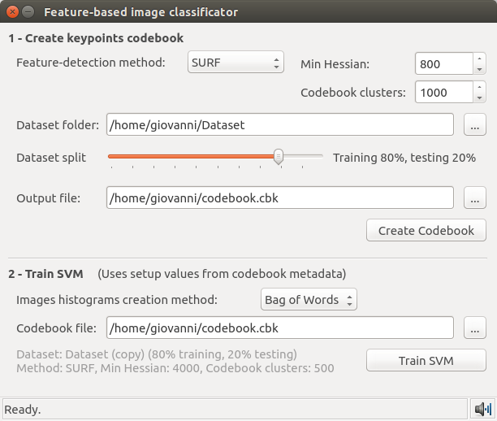

<big>**Feature-based image classificator: application usage**</big>

 

**Main Window**

This is the program's main window. As you can see, it's subdivided into two main parts, the first to setup and run the codebook creation and the second to train and test the SVM doing the proper classification.

*@see <a href="window.png">window.png</a>*

 

**Initial parameters setup**

On the top of the window you'll find the parameters to tell the program how to create the codebook. 

These parameters are:

1. *Feature-detection method* <small>One of SURF, SIFT, KAZE or ORB</small>
2. *Min hessian* <small>Minimum Hessian value to detect keypoints. For SIFT only</small>
3. *Codebook clusters* <small>Number of clusters to group all the detected features (codebook size)</small>
4. *Dataset folder* <small>Input dataset folder. Accepts tilde as home path and filesystem browsing using the button on the right side.  *@see* Dataset structure *below* </small>
5. *Dataset split* <small>Set the percentage of images to use for SVM training and use the rest to test</small>
6. *Output file* <small>Output file to save the generated codebook. Accepts tilde as home path and filesystem browsing using the button on the right side.</small>

 

**Codebook creation**

Once you've setup all the parameters, click on *Create Codebook* button to start the codebook creation process. This will extract the keypoints from each image of the training subset and then cluster them in the desired number of codebook entries. 

*KMeans* is used as clustering algorithm for SURF, SIFT and KAZE.
*KMajority* is used for ORB.

The resulting .cbk file contains an header with the parameters used to create the codebook (which will later be needed during the testing part) and the matrix representing the codebook data.

 

**Training and testing**

Once you've set the input codebook file, use the dropdown to select an *Images histogram creation method*, which can be *Bag of Words* or *Fisher Vector* (not for ORB).

Click on *Train SVM* to start the process.

This will extract again all the keypoints from the images of the training subset and  create an histogram matching each keypoint to a codebook entry, using either *BoW* or *FV*. 
The histograms are then passed to the SVMs, which are trained from those labelled examples. 
Finally, an histogram is created from each image of the testing dataset and feeded to the SVM, which will return the image category.

After the whole process is done, an image file (*confusion_matrix.png*) is created in the working directory, summing up the work done and the resulting Accuracy, Precision and Recall of the classification process in the form of a confusion matrix.

 

**Dataset structure**

This program is designed to work with the Caltech 101 dataset (<a href="http://www.vision.caltech.edu/Image_Datasets/Caltech101/">http://www.vision.caltech.edu/Image_Datasets/Caltech101/</a>), but you can create your own dataset respecting this folder structure structure and file naming:

Dataset/ 
&nbsp;&nbsp;category1/ 
&nbsp;&nbsp;&nbsp;&nbsp;image_0001.jpg 
&nbsp;&nbsp;&nbsp;&nbsp;image_0002.jpg 
&nbsp;&nbsp;&nbsp;&nbsp;image_0003.jpg 
&nbsp;&nbsp;&nbsp;&nbsp;.. 
&nbsp;&nbsp;category2/ 
&nbsp;&nbsp;&nbsp;&nbsp;image_0001.jpg 
&nbsp;&nbsp;&nbsp;&nbsp;image_0002.jpg 
&nbsp;&nbsp;&nbsp;&nbsp;image_0003.jpg 
&nbsp;&nbsp;&nbsp;&nbsp;.. 
&nbsp;&nbsp;category3/ 
&nbsp;&nbsp;&nbsp;&nbsp;image_0001.jpg 
&nbsp;&nbsp;&nbsp;&nbsp;image_0002.jpg 
&nbsp;&nbsp;&nbsp;&nbsp;image_0003.jpg 
&nbsp;&nbsp;&nbsp;&nbsp;.. 
&nbsp;&nbsp;..

Obiouvsly categories can have different names, as the executable will read any subfolder in the Dataset folder provided, but for now we'll just read files with the exact naming convention stated above and in jpg format. (Todo: read image files - jpg and png - with any name)

As the confusion matrix is printed in an image file, the dataset should contain 2-8 categories to display it properly. It will still work with larger datasets, but the results will have to be read from the log file.

To balance the machine learning process that is done in this program, it would be better if all the categories had the same number of images.

 

**Log file**

A log file of the run process (*logfile.log*) is created in the working directory. It will contain the runtime debug of the program, including results, task durations and the complete confusion matrix.

 
